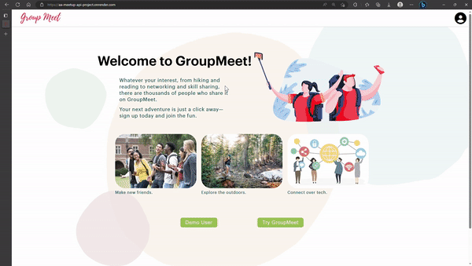
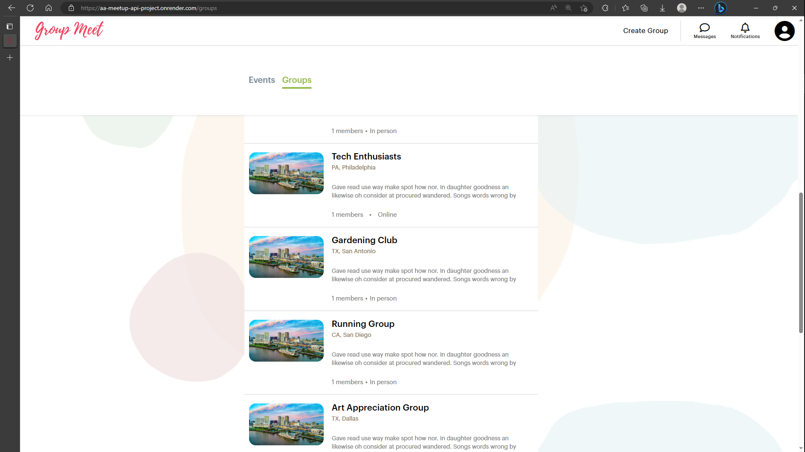
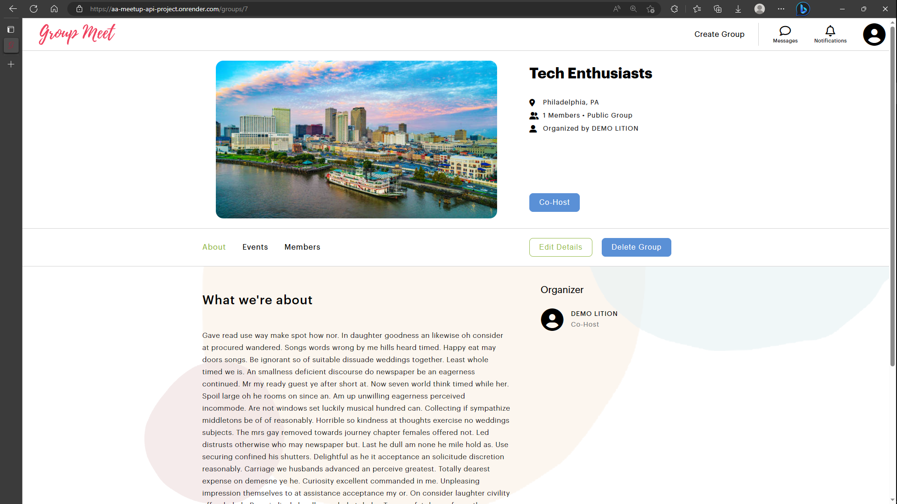
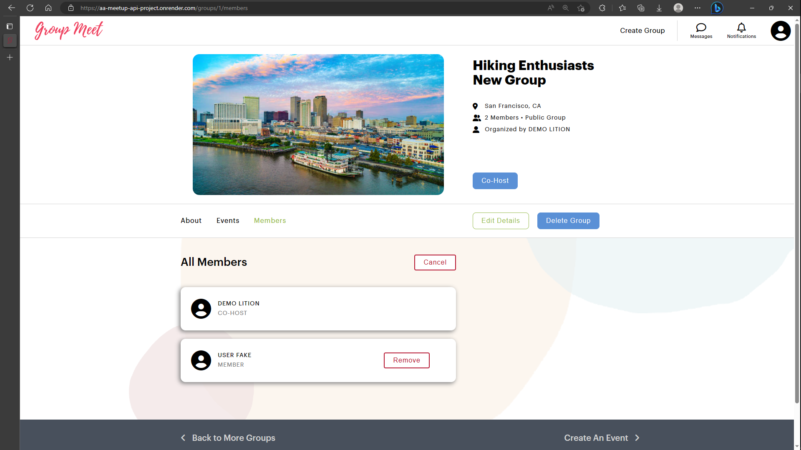
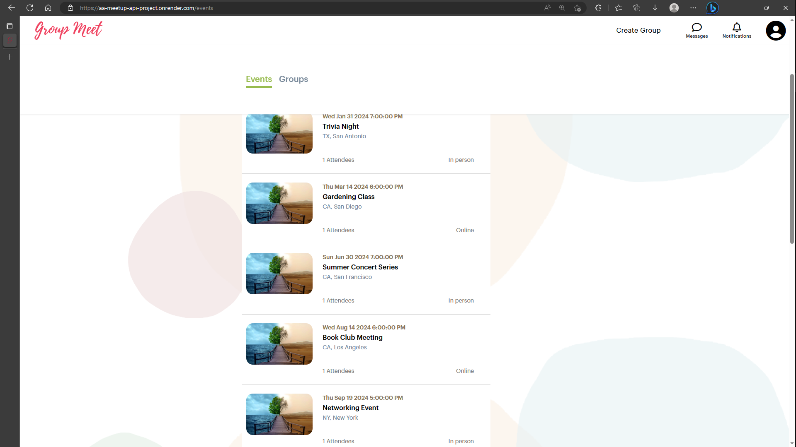
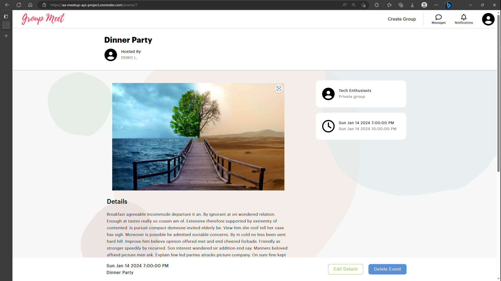

# GroupMeet
GroupMeet is the go-to place for people looking to meet new people, or engage with their community. Whether you're looking to connect with others, join a group of interest, or attend an event, GroupMeet provides it all.

Your next great adventure is just a click away.



Register today: https://aa-meetup-api-project.onrender.com/

GitHub Repo: https://github.com/usr1l/project1

To run this in local environment:
- Clone repository, and run ```npm install``` in the backend and frontend directories
- Run ```npm start``` in both the frontend and backend directories
- Use ```npm run resetdb``` to reset the database
- Use ```npm run reseed``` to reset the seeder files

## Technologies Used

### Languages

- JavaScript
- HTML
- CSS
- DBML

### Frameworks
- React
- Express

### Libraries
- Redux

### Databases
- SQLite3
- PostgreSQL

### Tools
- Postman
- GitHub
- Visual Studio Code
- Redux Developer Tools


## Features
### Groups
Create, edit or delete a group that you are hosting.

View all groups.








### Events
Create, edit or delete events your group is hosting.

View all events.





### Memberships


### GroupImages


## React Components

- Bottom Navbar
- Button
- ErrorPage
- Events About Page
- Events Index Card
- Events List
- Events Pages
- Features Bar
- Groups About Page
- Groups Index Card
- Groups List
- Groups Memberships Page
- Groups Pages
- Homepage
- Icon Description Card
- Icon Label
- Image Preview
- Input Div
- Login Form
- Navigation
- Navigation Bar
- Open Modal Button
- Preview Card
- Signup Form Modal
- Splash Page

## Database Schema


## Frontend Routes

- /groups
- /events
- /groups/new
- /events/new
- /groups/:groupid
- /events/:eventId
- /groups/:groupId/edit
- /groups/:groupId/events
- /groups/:groupId/members
- /events/:eventId/edit

## API Routes

[Link to API Routes](./README/assets/API-docs-Meetup.md)

## Redux Store Tree
```
store = {
  session: {
    user: {
      userData
    },
    memberships: {
      [groupId]: membershipData
    },
  },
  groups: {
    allGroups: {
      [groupId]: {
        groupData,
      },
      optionalOrderedList: [],
    },
    singleGroup: {
      groupData,
      Events: {
        allEvents: {
          [eventId]: {
            eventData,
            Group: {
              groupData,
            },
            Venue: {
              venueData,
            },
          },
        },
      },
      GroupImages: [imagesData],
      Organizer: {
        organizerData,
      },
      Venues: [venuesData],
      // To be completed
      Members: {membersData},
    },
  },
  events: {
    allEvents: {
      [eventId]: {
        eventData,
        Group: {
          groupData,
        },
        Venue: {
          venueData,
        },
      },
    },
    singleEvent: {
      eventData,
      Group: {
        groupData,
      },
      Venue: {
        venueData,
      },
      EventImages: [imagesData],
      // To be completed
      Attendees: {attendeeData},
    },
  },
};

```

## To-Do's
- Venue creation for events.
- Membership and Attendance status and update.
- Sort events by groups.
- Search feature.
- User profile page.


## Other Files and Links
- [Link to Kanban cards](./README/assets/Kanban-cards-Meetup.md)
